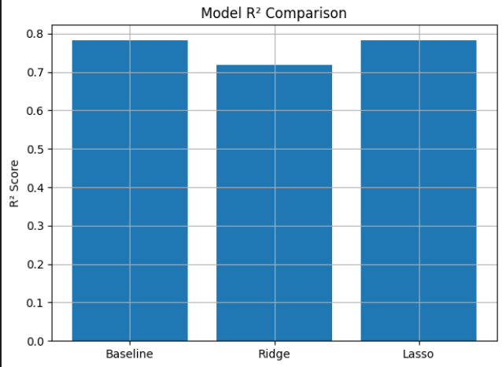
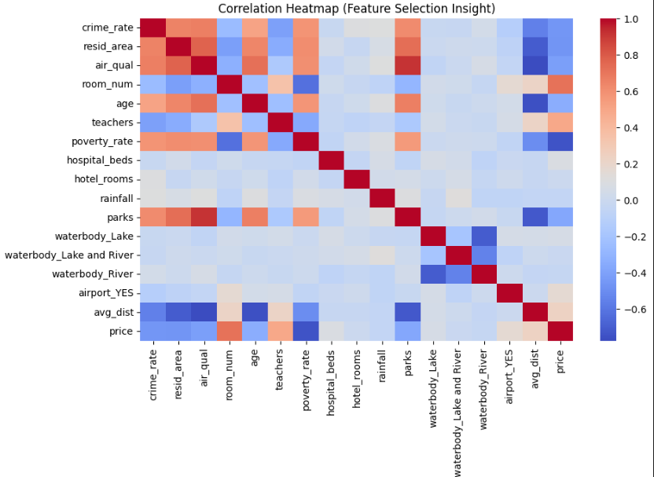
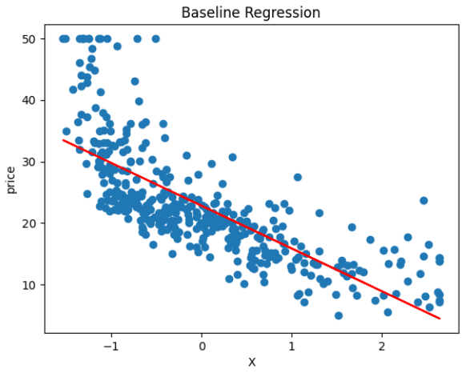
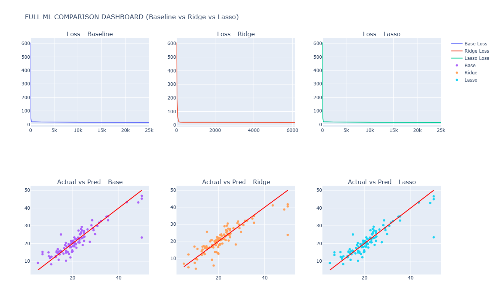

# 🏠 House Price Prediction using Regression Analysis

A Machine Learning project that predicts house prices using **Linear Regression**, **Multiple Linear Regression**, **Ridge Regression**, and **Lasso Regression**. The project demonstrates the complete machine learning workflow, including data preprocessing, feature engineering, model development, regularization, and evaluation.

---

# 📌 Project Overview

House price prediction is one of the most common regression problems in machine learning. This project analyzes housing data to identify the factors that influence property prices and develops regression models capable of estimating house values accurately.

The project follows a complete machine learning pipeline from data exploration to model evaluation while comparing the effect of different regularization techniques.

---

# 🎯 Objectives

- Analyze housing market data.
- Explore relationships between housing features and price.
- Clean and preprocess the dataset.
- Build regression models from scratch.
- Compare Linear Regression, Ridge Regression, and Lasso Regression.
- Evaluate model performance using multiple regression metrics.

---

# 📊 Dataset

The dataset contains information about residential houses collected from different locations.

### Features include:

- Crime Rate
- Air Quality
- Number of Rooms
- House Age
- Distance to Important Locations
- Airport Availability
- Waterbody
- Bus Terminal

### Target Variable

**House Price**

---

# 🛠 Technologies Used

- Python
- Pandas
- NumPy
- Matplotlib
- Scikit-learn

---

# 📂 Project Workflow

## 1. Exploratory Data Analysis

- Dataset inspection
- Summary statistics
- Duplicate detection
- Correlation analysis
- Numerical and categorical feature analysis

---

## 2. Data Preprocessing

The following preprocessing steps were applied:

- Missing value imputation
- One-Hot Encoding
- Duplicate removal
- Outlier handling using IQR
- Dataset alignment
- Feature scaling
- Feature selection

---

## 3. Feature Engineering

Several preprocessing improvements were performed:

- Average Distance Feature (avg_dist)
- Removal of redundant variables
- Correlation-based feature selection
- Dimensionality reduction

---

## 4. Regression Models

### Simple Linear Regression

Implemented from scratch using **Gradient Descent**.

Selected Feature:

**poverty_rate**

Regression Equation:

**Price = 17.19 − 5.24 × Poverty Rate**

---

### Multiple Linear Regression

Built using multiple housing features to improve prediction accuracy.

---

### Ridge Regression (L2)

Applied regularization to reduce coefficient variance and improve stability.

---

### Lasso Regression (L1)

Applied regularization for feature selection and model simplification.

---

# 📈 Model Evaluation

The regression models were evaluated using:

- SSE
- MSE
- RMSE
- R² Score
- Adjusted R²

---

# 📷 Results

## 📊 Model Comparison (R² Score)

Comparison of the R² scores achieved by the three regression models.



---

## 🔥 Correlation Heatmap

Visualization of the correlation between numerical features and the target variable.



---

## 📈 Linear Regression

Regression line showing the relationship between **poverty_rate** and house price.



---

## 📊 Baseline vs Ridge vs Lasso Comparison

Comparison dashboard including:

- Loss Curves
- Actual vs Predicted
- Baseline vs Ridge vs Lasso



---

# 🏆 Results Summary

| Model | R² Score |
|--------|----------|
| Linear Regression | ≈ 0.56 |
| Ridge Regression | ≈ 0.55 |
| Lasso Regression | ≈ 0.56 |

The results show that **poverty_rate** is a meaningful predictor of house prices, explaining approximately **56%** of the price variance.

Regularization had only a slight effect because the simple regression model relies on a single predictor.

---

# 💡 Key Findings

- Poverty Rate has a significant negative relationship with house prices.
- Ridge Regression improves coefficient stability.
- Lasso Regression simplifies the model through regularization.
- Multiple Linear Regression captures more complex relationships between features.
- Proper preprocessing significantly improves model quality.

---

# 🚀 Future Improvements

- Random Forest Regression
- XGBoost Regressor
- Gradient Boosting
- Feature Selection using Recursive Feature Elimination (RFE)
- Hyperparameter Optimization
- Model Deployment using Flask or Streamlit

---

# 📁 Project Structure

```
House-Price-Prediction-Regression/
│
├── House_Price_Regression.ipynb
├── housing_dataset.csv
│
├── images/
│   ├── r2_comparison.png
│   ├── correlation_heatmap.png
│   ├── regression_plot.png
│   └── model_comparison.png
│
├── README.md
├── requirements.txt
├── LICENSE
└── .gitignore
```

